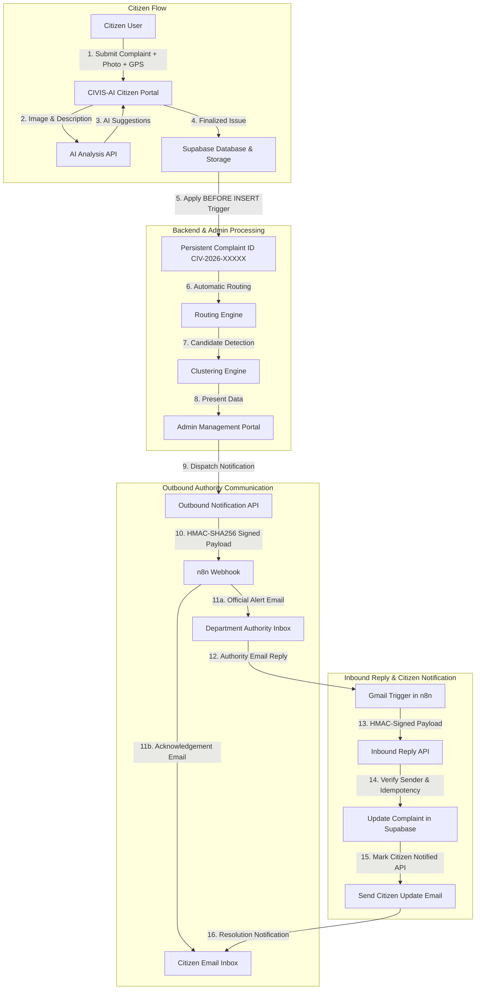

# CIVIS-AI

> **Smart Civic Issue Reporting & Administrative Management Platform**

CIVIS-AI is a smart civic grievance reporting and municipal management platform designed to bridge the gap between citizens and city administrations. The platform enables residents to report local infrastructure issues with photo and geolocation data, utilizes a multimodal AI pipeline to analyze and classify submitted complaints, automatically routes issues to appropriate municipal departments, identifies potential duplicate incidents through spatial and semantic clustering, and supports automated, bidirectional email communication with municipal authorities via n8n workflows.

CIVIS-AI incorporates functional prototypes for AI-assisted grievance analysis and civic intelligence demonstration while maintaining strict server-side security, role-based access control, and deterministic database guarantees.

---

## 📋 Table of Contents

- [Key Features](#-key-features)
- [System Architecture & Workflow](#-system-architecture--workflow)
- [Tech Stack](#-tech-stack)
- [Multimodal AI Pipeline](#-multimodal-ai-pipeline)
- [Spatial & Semantic Incident Clustering](#-spatial--semantic-incident-clustering)
- [Administrative Prioritization Engine](#-administrative-prioritization-engine)
- [Authority Communication Workflow](#-authority-communication-workflow)
- [Data Model & Entities](#-data-model--entities)
- [Security & Privacy Architecture](#-security--privacy-architecture)
- [Social Pulse — Demo Mode](#-social-pulse--demo-mode)
- [Repository Structure](#-repository-structure)
- [API Endpoints](#-api-endpoints)
- [Testing & Quality Assurance](#-testing--quality-assurance)
- [Local Setup & Development](#-local-setup--development)
- [Deployment](#-deployment)
- [Current Status & Limitations](#-current-status--limitations)
- [Future Enhancements](#-future-enhancements)
- [License & Acknowledgments](#-license--acknowledgments)

---

## 🚀 Key Features

### 👤 Citizen Portal
- **User Authentication:** Secure user sign-up, sign-in, and session management powered by Supabase Auth.
- **Civic Complaint Submission:** Seamless grievance reporting with photo upload and descriptive text.
- **Geolocation & Mapping:** Automatic browser GPS location capture, manual map pin adjustment on Leaflet, address autofill via OpenStreetMap reverse geocoding, and location accuracy tracking.
- **AI-Assisted Scan:** Real-time multimodal analysis suggesting category, title, description, and severity for user review before submission.
- **Citizen Review & Editing:** Full citizen control to review, edit, or override AI-generated categories and descriptions prior to final persistence.
- **Personal Complaint Tracking:** Real-time tracking of personal complaint statuses, resolution progress, and department assignment.
- **Authority Response Updates:** In-app inspection of official authority feedback and action notes.
- **Automated Email Notifications:** Citizen acknowledgement emails upon dispatch and resolution notification emails when authorities reply.

### 🤖 AI Intelligence (Prototype Pipeline)
- **Multimodal Vision & Text Analysis:** Evaluates complaint images alongside textual descriptions.
- **Automated Category Detection:** Suggests canonical municipal categories from visual and contextual cues.
- **Severity Estimation & Score:** Computes estimated severity (`Normal`, `Moderate`, `High`, `Critical`) and numerical severity score ($1\text{--}100$).
- **AI Confidence Signal:** Model confidence metric reflecting visual detection clarity (*note: estimated signal, not a calibrated probability*).
- **Tag Extraction & Reasoning:** Generates descriptive visual tags and an analytical reasoning summary.
- **Civic Issue Validity Check:** Identifies whether the uploaded image depicts a legitimate civic problem.
- **Model Version Tracking:** Records the active AI model version and analysis timestamp for auditability.

### 🏛️ Municipal Administration Portal
- **Role-Based Access Control:** Strict database-level isolation ensuring only verified administrators access city data.
- **Citizen Issues Management:** Comprehensive searchable and filterable table supporting multi-criteria search, status updates, priority filtering, and photo inspection via signed URLs.
- **Executive KPI Dashboard:** Real-time counters for active complaints, critical issues, SLA breaches, and resolution rates.
- **Visual Analytics:** Interactive Chart.js visualizations for category breakdown, department workload, severity distribution, and historical filing trends.
- **Operational Command Center:** Real-time monitoring of department backlogs, high-priority issues, and system metrics.
- **Incident Candidate Review:** Administrative review interface for reviewing spatially and semantically linked complaint clusters.
- **Manual Department Reassignment:** Administrative override capability to reassign misrouted complaints to alternate departments.
- **System Health Monitor:** Live database connectivity, storage latency, and API operational status dashboard.

### 🔗 Incident Intelligence & Deduplication
- **Spatial & Temporal Clustering:** Groups potential duplicate reports within 100 meters and a 7-day rolling window.
- **Semantic & Tag Similarity:** Computes textual overlap across descriptions and visual tags.
- **Candidate Incident Scoring:** Evaluates candidate relationship strength ($0\text{--}100$) before presenting to administrators.
- **Administrative Incident Linking:** Distinguishes between automated *candidate incidents* and administrator-confirmed *parent incidents*.

### 🚦 Department Routing
- **Deterministic Category-to-Department Mapping:** Routes complaints automatically to registered municipal departments based on canonical categories.
- **Supported Departments:**
  1. `Road Maintenance & PWD`
  2. `Solid Waste & Sanitation`
  3. `Electrical & Street Lighting`
  4. `Water Supply & Drainage`
  5. `General Municipal Administration`

### 📬 Authority & Citizen Communication (n8n Integration)
- **Outbound Notification Dispatch:** Server-to-n8n webhook triggers HMAC-SHA256 signed payloads containing structured complaint details, AI insights, and citizen contact info.
- **Official Authority Email:** Delivers formatted grievance reports to the registered department executive.
- **Citizen Dispatch Acknowledgement:** Sends an automated email confirmation to the reporting citizen upon authority notification.
- **Inbound Reply Processing:** Captures authority email responses via Gmail trigger in n8n and routes them to a secure serverless webhook.
- **Authority Sender Authentication:** Validates sender identity against the active `department_authorities` registry before applying updates.
- **Automated Status Updates:** Maps authority responses (`IN_PROGRESS`, `COMPLETED`) directly to complaint statuses (`In Progress`, `Resolved`).
- **Persistent Complaint Identifiers:** Deterministic complaint tracking format (`CIV-2026-XXXXX`).

---

## 🔄 System Architecture & Workflow



---

## 🛠️ Tech Stack

| Layer | Technologies / Libraries | Purpose |
| :--- | :--- | :--- |
| **Frontend** | HTML5, CSS3, JavaScript (ES6+), Tailwind CSS | Responsive UI for Citizen and Admin portals |
| **Mapping & Geocoding** | Leaflet.js, OpenStreetMap, Nominatim API | Interactive mapping, GPS pinning, and reverse geocoding |
| **Data Visualization** | Chart.js | Executive KPI charts, workload breakdown, and trend analysis |
| **Backend & API** | Node.js, Vercel Serverless Functions | Secure serverless API endpoints and webhook handlers |
| **Database & Auth** | Supabase (PostgreSQL 15+), Supabase Auth | Relational storage, user authentication, and profile triggers |
| **Storage** | Supabase Private Storage (`issue-images`) | Secure private storage with temporary signed URL access |
| **AI Vision & Text** | Groq SDK (Qwen Multimodal) / Google Gemini API | Multimodal image classification, severity rating, and tag extraction |
| **Workflow Automation** | n8n, Gmail Integration | Outbound authority dispatches and inbound email reply workflows |
| **Security & Cryptography**| Node `crypto` (HMAC-SHA256, `timingSafeEqual`), Supabase RLS | Webhook integrity, service-role isolation, and role-based policies |
| **Deployment** | Vercel, GitHub | Continuous deployment and static asset hosting |

---

## 🧠 Multimodal AI Pipeline

CIVIS-AI utilizes a multimodal AI vision and language pipeline to provide structured pre-submission analysis:

```text
[Citizen Image + Text]
       ↓
[Client-side Compression & Base64 Encoding]
       ↓
[POST /api/analyze_issue (JWT Authenticated)]
       ↓
[Multimodal LLM Inference (Groq / Gemini Provider)]
       ↓
[JSON Output Schema Validation & Sanitization]
       ↓
[Interactive Citizen Review & Confirmation]
       ↓
[Database Persistence]
```

### Stored AI Analysis Fields
- `ai_category`: Detected infrastructure category.
- `ai_severity`: Qualitative severity classification (`Normal`, `Moderate`, `High`, `Critical`).
- `ai_severity_score`: Integer rating from $1$ to $100$ representing the automated model-generated severity signal:
  - $75\text{--}100 \rightarrow$ **Critical**
  - $50\text{--}74 \rightarrow$ **High**
  - $25\text{--}49 \rightarrow$ **Moderate**
  - $1\text{--}24 \rightarrow$ **Normal**
- `ai_confidence`: Model confidence estimate percentage ($0\text{--}100\%$).
- `ai_detected_tags`: Array of identified features (e.g., `["pothole", "asphalt_crack", "road_hazard"]`).
- `ai_recommended_action`: Suggested remedial action for municipal field crews.
- `ai_reasoning_summary`: Explanation of factors driving the classification.
- `ai_is_valid_civic_issue`: Boolean flag indicating whether the image depicts genuine public infrastructure.
- `ai_model_version`: Identifier of the AI model and prompt version.
- `ai_analyzed_at`: ISO timestamp of the inference event.

> **Important Note:** AI confidence is an estimated model confidence signal and should not be interpreted as a calibrated probability. The AI severity score ($1\text{--}100$) is a model-generated severity signal, distinct from the administrative Priority Attention Score (PAS). Neither score constitutes a calibrated prediction. Final classification is confirmed by the citizen during submission and verified by city administrators.

---

## 📍 Spatial & Semantic Incident Clustering

The platform includes a candidate detection engine (`api/detect_candidates.js` and `public/js/clustering_engine.js`) designed to identify duplicate reports of the same physical incident:

### Clustering Heuristics & Rules
- **Geographic Distance:** Maximum spatial separation threshold of **100 meters** (Haversine formula).
- **Temporal Window:** Maximum time interval of **7 days** between reports.
- **Category Requirement:** Exact match on canonical category required.
- **Semantic Overlap:** Jaccard similarity computed across description tokens and detected AI tags.
- **Candidate Score Calculation:** Composite score ($0\text{--}100$) derived from spatial proximity, time closeness, and semantic similarity.
- **Candidate Threshold:** Pairs scoring **$\ge 50$** are flagged as candidate duplicate incidents.
- **Fallback Exclusion:** Non-GPS fallback coordinates are strictly excluded from spatial distance calculations.
- **Administrative Confirmation:** Candidate detection does **not** automatically merge complaints; administrators review and confirm incident linkage via the Admin portal.

---

## 📊 Administrative Prioritization Engine

To assist city officials in triaging large volumes of reports, CIVIS-AI implements a deterministic **Priority Attention Score (PAS)** ($0\text{--}100$):

$$\text{Priority Attention Score} = (\text{Severity} \times 0.35) + (\text{Category Impact} \times 0.25) + (\text{Incident Density} \times 0.15) + (\text{SLA Aging} \times 0.15)$$

### Priority Action Bands
- **P1 (Critical Attention):** Score $\ge 75$ — Immediate field dispatch required (e.g., major water main burst, live exposed electrical cables).
- **P2 (High Priority):** Score $55\text{--}74$ — Urgent resolution within standard municipal SLA.
- **P3 (Medium Priority):** Score $35\text{--}54$ — Scheduled maintenance workload.
- **P4 (Low Priority):** Score $< 35$ — Routine non-hazardous civic reports.

*Note: The Priority Attention Score (PAS) is an administrative triaging and workload scheduling metric, distinct from the model-generated AI severity signal, and is not a calibrated predictive machine-learning outcome.*

---

## 📬 Authority Communication Workflow

CIVIS-AI integrates with n8n to automate the communication lifecycle between the platform, municipal department authorities, and citizens.

```
+-----------------------------------------------------------------------------------------+
|                                OUTBOUND NOTIFICATION FLOW                                |
+-----------------------------------------------------------------------------------------+
  Admin clicks "Notify Authority" (or automated trigger)
    → POST /api/notify_authority
    → Backend retrieves registered authority official_email from department_authorities
    → Generates HMAC-SHA256 signature using N8N_AUTHORITY_WEBHOOK_SECRET
    → Dispatches webhook to n8n
    → n8n sends official alert email to Authority
    → n8n sends dispatch confirmation email to Citizen

+-----------------------------------------------------------------------------------------+
|                                 INBOUND REPLY FLOW                                      |
+-----------------------------------------------------------------------------------------+
  Authority replies to the email (e.g., "Crew dispatched, road patched.")
    → Gmail trigger captures email in n8n
    → n8n parses complaint_id, status (IN_PROGRESS / COMPLETED), and message body
    → Signs payload with HMAC-SHA256 using N8N_AUTHORITY_REPLY_SECRET
    → POST /api/process_authority_reply
    → Backend validates signature and verifies sender_email against department_authorities
    → Updates public.issues: status = 'In Progress' / 'Resolved', authority_response = message
    → POST /api/mark_citizen_notified records delivery state
    → n8n delivers status update email to Citizen
```

### Status Normalization Mapping
| Authority Reply Keyword | Database Issue Status | Citizen Portal Status |
| :--- | :--- | :--- |
| `IN_PROGRESS` | `In Progress` | `In Progress` |
| `COMPLETED` | `Resolved` | `Resolved` |

---

## 🗄️ Data Model & Entities

The PostgreSQL database schema consists of core relational entities with Row Level Security (RLS):

- **`public.profiles`**: User account profiles linked to `auth.users`, storing `full_name`, `email`, `phone`, and `role` (`citizen` or `admin`). Protected by triggers against unauthorized self-elevation.
- **`public.issues`**: Primary civic complaint records containing complaint details, location (`lat`, `lng`, `location`), status, department, AI enrichment fields, persistent `complaint_id`, and authority tracking columns (`authority_response`, `authority_responded_at`, `authority_reply_message_id`, `citizen_notified`).
- **`public.incidents`**: Parent incident clusters representing multi-complaint civic occurrences.
- **`public.incident_candidates`**: Pre-computed pairwise relationship records linking complaints based on spatial and semantic similarity.
- **`public.department_authorities`**: Registry of municipal department contacts, containing `department_name`, `authority_name`, `official_email`, and `jurisdiction_zone`.

### Persistent Complaint Identifiers
Every issue is assigned a persistent, human-readable complaint identifier generated via database triggers:
```text
CIV-2026-00001
CIV-2026-00002
CIV-2026-00024
...
```

---

## 🔒 Security & Privacy Architecture

CIVIS-AI implements comprehensive security controls across all architectural tiers:

- **Row Level Security (RLS):** All Supabase tables enforce granular RLS policies. Citizens can only select/update their own reports; administrative access is restricted to verified `profiles.role = 'admin'` sessions.
- **Role Elevation Protection:** PostgreSQL `BEFORE INSERT OR UPDATE` triggers sanitize user role assignment, preventing privilege escalation.
- **Service-Role Key Isolation:** `SUPABASE_SERVICE_ROLE_KEY` is strictly confined to serverless API environments and is never bundled in client assets.
- **HMAC-SHA256 Webhook Signatures:** All n8n webhook dispatches and inbound reply endpoints verify HMAC-SHA256 signatures with constant-time `crypto.timingSafeEqual` comparison.
- **Strict Server-Side Authority Resolution:** Outbound recipient emails are resolved server-side from `department_authorities`; client-supplied recipient parameters are strictly ignored.
- **Rate Limiting:** In-memory rate limiting guards on all serverless endpoints (`/api/notify_authority`, `/api/process_authority_reply`, `/api/analyze_issue`, etc.) returning HTTP 429 with `Retry-After` headers upon threshold breach.
- **Input Sanitization & HTML Escaping:** All user-generated text (titles, descriptions, comments) is escaped before DOM insertion to prevent Cross-Site Scripting (XSS).
- **Private Storage with Signed URLs:** Complaint images are stored in a private bucket (`issue-images`); authorized users access photos via time-limited signed URLs.

---

## 📡 Social Pulse — Demo Mode

> **Notice:** The **Social Pulse** interface ([`public/admin/social_pulse.html`](file:///c:/CIVIC/public/admin/social_pulse.html)) operates in **DEMO MODE** using simulated civic signals. It does **not** ingest live data from X (Twitter), Instagram, Facebook, or news outlets.

The page demonstrates the intended architectural pipeline for future public-signal ingestion:

$$\text{Signal Detected} \longrightarrow \text{AI Classification} \longrightarrow \text{Location Identified} \longrightarrow \text{Incident Clustered} \longrightarrow \text{Admin Verification} \longrightarrow \text{Convert to Complaint}$$

- **Simulate Signal:** Administrators can generate sample civic signals (road damage, sanitation, electrical faults) across demo locations (e.g., Pune, Ratnagiri) to test triaging.
- **Convert to Complaint:** Allows administrators to convert a simulated signal into an active civic complaint in the database with status `Pending Verification` and a persistent complaint ID.

---

## 📁 Repository Structure

```text
CIVIS-AI/
├── api/                                 # Serverless API Endpoints (Vercel)
│   ├── analyze_issue.js                 # Multimodal AI analysis endpoint
│   ├── detect_candidates.js             # Incident clustering candidate detector
│   ├── mark_citizen_notified.js         # Citizen notification delivery tracking API
│   ├── notify_authority.js              # HMAC-signed n8n authority dispatch endpoint
│   ├── process_authority_reply.js       # Secure inbound authority reply receiver
│   └── webhooks/                        # Webhook verification handlers
│       ├── meta.js                      # Meta Graph API verification endpoint
│       └── x.js                         # X Account Activity verification endpoint
│
├── public/                              # Static Frontend Application
│   ├── admin/                           # Municipality Admin Portal
│   │   ├── admin_dashboard.html         # Executive Admin Dashboard & KPIs
│   │   ├── citizen_issues.html          # Searchable complaint management table
│   │   ├── ai_analysis.html             # AI analysis & predictive trends
│   │   ├── smart_map.html               # Leaflet geographic incident map
│   │   ├── social_pulse.html            # Social Pulse (Demo Mode) interface
│   │   ├── system_health.html           # System latency & connectivity monitor
│   │   ├── my_complaints.html           # Admin complaint list view
│   │   ├── profile.html                 # Admin settings & profile
│   │   └── app.js                       # Admin UI controller & Supabase client
│   │
│   ├── user/                            # Citizen Portal
│   │   ├── index.html                   # Citizen dashboard & complaint submission
│   │   ├── my_complaints.html           # Personal complaint tracking view
│   │   ├── smart_map.html               # Citizen community incident map
│   │   ├── emergency.html               # Municipal emergency services dialer
│   │   ├── profile.html                 # User profile management
│   │   └── app.js                       # Citizen UI controller & Supabase client
│   │
│   └── js/                              # Shared Computational Engines
│       ├── clustering_engine.js         # Spatial & semantic candidate clustering
│       ├── prioritization_engine.js     # Priority Attention Score (PAS) algorithm
│       └── routing_engine.js            # Canonical category-to-department routing
│
├── scripts/                             # Build & Utility Scripts
│   ├── sync_api.js                      # API & engine synchronization build script
│   ├── generate_doc.js                  # Automated documentation generator
│   └── take_screenshots.js              # UI testing screenshot utility
│
├── supabase/                            # Database Schemas & Migrations
│   └── migrations/                      # Versioned SQL migration scripts
│       ├── phase10a_department_authorities.sql
│       ├── phase10b_authority_notification_tracking.sql
│       ├── phase10d1_persistent_complaint_ids.sql
│       ├── phase10d2_authority_reply_tracking.sql
│       ├── supabase_phase1_migration.sql
│       ├── supabase_phase2_ai_enrichment.sql
│       ├── supabase_phase3_department_routing.sql
│       └── supabase_phase4_incident_clustering.sql
│
├── tests/                               # Comprehensive Automated Test Suites
│   ├── test_phase10a_authority_registry.js
│   ├── test_phase10b_authority_notification.js
│   ├── test_phase10d1_complaint_id.js
│   ├── test_phase10d2_authority_reply.js
│   ├── test_phase10d3_mark_citizen_notified.js
│   ├── test_phase9a_webhook_security.js
│   ├── test_phase9b_ai_security.js
│   ├── test_phase9c_privacy.js
│   └── ... (19 test suites total)
│
├── package.json                         # Node.js dependencies & scripts
├── vercel.json                          # Vercel routing & deployment configuration
└── README.md                            # Comprehensive project documentation
```

---

## 🔌 API Endpoints

| Endpoint | Method | Authentication | Description |
| :--- | :--- | :--- | :--- |
| `/api/analyze_issue` | `POST` | Bearer JWT (Citizen/Admin) | Receives an image and text description, runs multimodal LLM inference, and returns structured AI classification. |
| `/api/detect_candidates` | `POST` | Bearer JWT (Citizen/Admin) | Computes spatial (100m), temporal (7-day), and semantic similarity across complaints to return candidate clusters. |
| `/api/notify_authority` | `POST` | Bearer JWT (Admin / Owner) | Resolves authority contact server-side, signs payload with HMAC-SHA256, and dispatches notification webhook to n8n. |
| `/api/process_authority_reply` | `POST` | `X-CIVIS-Signature` (HMAC) | Receives incoming email responses from n8n, verifies sender authority, updates complaint status, and stores response. |
| `/api/mark_citizen_notified` | `POST` | `X-CIVIS-Signature` (HMAC) | Marks complaint as citizen-notified in database after n8n delivers the resolution email to the citizen. |

---

## 🧪 Testing & Quality Assurance

CIVIS-AI includes 19 dedicated test suites covering functional correctness, API contracts, security controls, and regression prevention:

- **Syntax & Compilation:** Node.js syntax verification across all serverless endpoints (`node --check`).
- **API 4-Way Parity:** Verifies byte-level synchronization across root `api/`, `public/api/`, `public/user/api/`, and `public/admin/api/`.
- **HMAC Cryptographic Verification:** Validates signature generation, timing-safe equality, and fail-closed behaviors.
- **Authority Communication Tests:** Validates outbound dispatch formatting, sender verification, status mapping, and idempotency.
- **Database & Trigger Tests:** Verifies persistent complaint ID formatting (`CIV-2026-XXXXX`), RLS policies, and role protection triggers.
- **Clustering & Prioritization Verification:** Validates Haversine distance math, Jaccard token matching, and PAS band calculations.

To execute the test suites:
```bash
# Run specific Phase 10 integration suites
node tests/test_phase10b_authority_notification.js
node tests/test_phase10d1_complaint_id.js
node tests/test_phase10d2_authority_reply.js
node tests/test_phase10d3_mark_citizen_notified.js
```

---

## ⚙️ Local Setup & Development

### 1. Prerequisites
- **Node.js:** v18.0.0 or higher
- **npm:** v9.0.0 or higher
- **Supabase Account:** With PostgreSQL database and Auth enabled

### 2. Clone Repository & Install Dependencies
```bash
git clone https://github.com/sarthakghag39-glitch/CIVIS-AI.git
cd CIVIS-AI
npm install
```

### 3. Synchronize API & Engine Modules
```bash
npm run build
```

### 4. Configure Environment Variables
Create a `.env` file in the project root or configure variables in your Vercel project settings:

```env
# Supabase Configuration
SUPABASE_URL=https://your-project-id.supabase.co
SUPABASE_ANON_KEY=your-supabase-anon-key

# Server-Side Only (Do NOT expose to client)
SUPABASE_SERVICE_ROLE_KEY=your-supabase-service-role-key

# Multimodal AI Provider Key
GROQ_API_KEY=your-groq-api-key
# OR
GEMINI_API_KEY=your-gemini-api-key

# n8n Authority Communication Webhooks
N8N_AUTHORITY_WEBHOOK_URL=https://your-n8n-instance/webhook/authority-notify
N8N_AUTHORITY_WEBHOOK_SECRET=your-outbound-hmac-secret
N8N_AUTHORITY_REPLY_SECRET=your-inbound-hmac-secret
```

### 5. Apply Database Migrations
Execute the SQL scripts located in `supabase/migrations/` sequentially in your Supabase SQL Editor to configure tables, triggers, and RLS policies.

### 6. Start Local Static Server
```bash
npm start
```
The citizen application will be accessible at `http://localhost:3000` (or `http://localhost:3000/admin/admin_dashboard.html` for the admin portal).

---

## 🚢 Deployment

CIVIS-AI is configured for continuous deployment on **Vercel**:

- **Citizen Application:** Deployed with root directory mapping to static assets (`public/`).
- **Admin Portal:** Deployed to a dedicated subdomain/project with root directory set to `public/admin`.
- **API Synchronization:** The build script (`scripts/sync_api.js`) automatically copies canonical serverless functions from `api/` to `public/api/`, `public/user/api/`, and `public/admin/api/` during deployment.
- **Clean URLs:** Managed via `vercel.json` for extensionless routing.

---

## ⚠️ Current Status & Limitations

- **Multimodal AI Pipeline:** The AI pipeline functions as an advisory classifier to accelerate reporting; it is not a legally binding or safety-certified decision system.
- **AI Confidence Signal:** The AI confidence value is a heuristic model signal and should not be used as a calibrated statistical probability.
- **Social Pulse Ingestion:** Operates exclusively in **Demo Mode** with simulated signals. Production social media APIs (X, Meta) are not connected.
- **Incident Clustering:** The clustering engine generates candidate pairs for administrative evaluation; it does not automatically merge complaints without official confirmation.
- **Geolocation Fallback:** If a citizen's device has geolocation disabled, location selection relies on manual map pinning.
- **n8n & Email Delivery:** External email notifications require active n8n workflows and configured SMTP/Gmail API credentials.

---

## 🔮 Future Enhancements

- **Authorized Public-Source Ingestion:** Connecting authorized municipal APIs and official webhook endpoints for public signal monitoring.
- **Calibrated AI Civic Benchmark:** Fine-tuning multimodal models against localized civic infrastructure datasets to improve category accuracy.
- **Graph-Based Incident Clustering:** Expanding spatial-temporal clustering into graph networks for complex municipal incident tracking.
- **Multichannel Notifications:** Adding SMS, WhatsApp, and push notification channels alongside email for citizen updates.
- **Mobile PWA Enhancements:** Enhanced offline caching and local image queueing for areas with low connectivity.

---

## 📄 License & Acknowledgments

This project is developed for educational, demonstration, and civic technology innovation purposes.

- Built with [Tailwind CSS](https://tailwindcss.com), [Leaflet](https://leafletjs.com), [Chart.js](https://www.chartjs.org), and [Supabase](https://supabase.com).
- Icons provided by Google Material Symbols & Icons.
